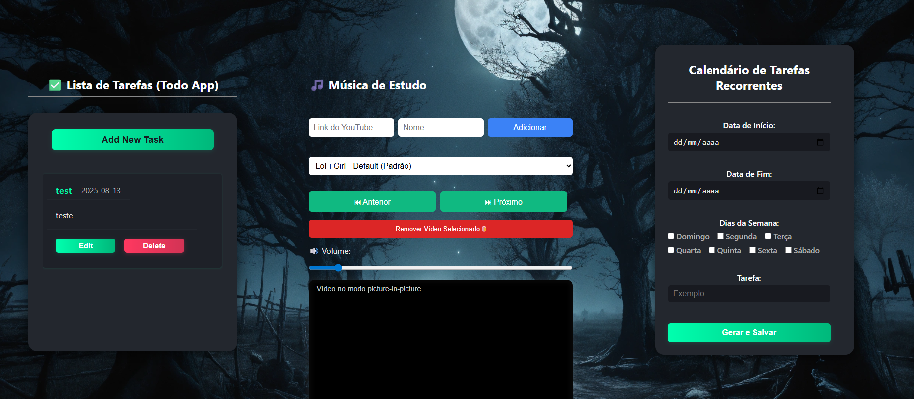
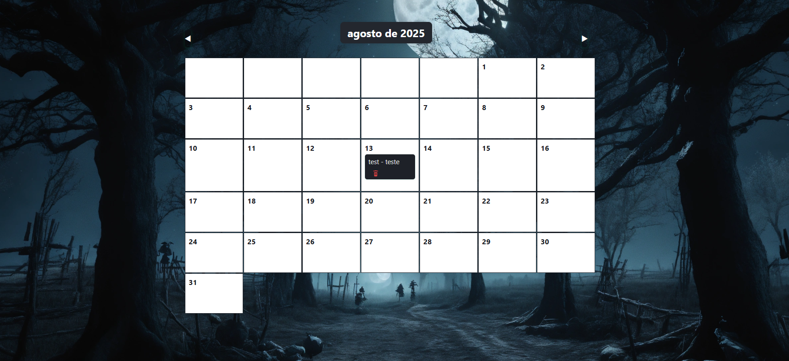

# Auxiliador de Produtividade

Este projeto é uma aplicação web que combina **gestão de tempo, foco e tarefas** em um só lugar, com um design limpo e minimalista.  
Contém um calendário, um mini player do YouTube para músicas de estudo e um aplicativo de tarefas (Todo App), tudo em uma interface moderna.

## Motivação

Sempre tive dificuldade com métodos tradicionais como o Pomodoro, pois acabava focando mais no tempo do que na própria tarefa. Tive a ideia de usar as cores do relógio para representar blocos do dia, com base no horário atual, e mostrar apenas a tarefa do momento.  

Mas eu vi que ainda havia muito espaço para melhorias, inclusive, fazer o projeto funcional para outras pessoas.  
Decidi melhorar uma Todo List e integrar isso ao meu projeto de produtividade.

Na versão inicial do projeto, o vídeo era fixo, definido no código fonte, o que não é uma boa ideia para o usuário. Mas tive a ideia de armazenar as opções com localStorage, de modo que o usuário pode enviar os links e selecionar o vídeo a ser tocado.

## Objetivo

Criar um ambiente de produtividade pessoal com:
- Todo List para registrar e organizar tarefas
- Calendário integrado para datas importantes e recorrentes e com integração com o Todo List
- Mini player de YouTube com seleção personalizada de músicas
- Layout modular, acessível e expansível

---

## O problema que esse projeto busca resolver

Hoje, muitas pessoas enfrentam dificuldades para manter o foco ao estudar, trabalhar ou aprender algo novo. Existem várias ferramentas separadas para relógio, listas de tarefas e música ambiente, mas nunca vi uma que une tudo isso em **um único espaço visual coerente e funcional**.

Com esse projeto, busco resolver isso ao oferecer tudo que for conveniente para essa organização em conjunto.

---

## Funcionalidades

- **Mini Player do YouTube:** Player embutido para músicas de estudo, já configurado para autoplay e volume em 10%, personalizavel pelo usuário.
- **Todo App:** Permite adicionar, editar e remover tarefas, com campos para título, data e descrição, automaticamente adicionadas ao calendário.
- **Calendário:** Exibe o mês atual com destaque para o dia atual e marca as datas com tarefas.
- **Tarefas Recorrentes:** Opção para marcar tarefas como recorrentes, que reaparecem de tempos em tempos.

## Tecnologias Utilizadas

- [HTML5](https://developer.mozilla.org/pt-BR/docs/Web/HTML)
- [CSS3](https://developer.mozilla.org/pt-BR/docs/Web/CSS)
- [JavaScript](https://developer.mozilla.org/pt-BR/docs/Web/JavaScript)

## Estrutura de Pastas

```
projeto/
│
├── css/
│   └── styles.css
│   └── list-styles.css
│   └── calendar-style.css
├── scripts/
│   ├── calendar-script.js
│   ├── clock.js
│   └── list.js
│   └── video.js
├── index.html
```


## Customização

- Para alterar o vídeo do player do YouTube, basta inserir o link do vídeo desejado no campo "Link do YouTube", inserir o nome que quiser para reconhecer o video, e clicar em "Adicionar". O vídeo será salvo no armazenamento local do navegador e estará disponível para seleção.


## Screenshots




---

## Observações
- A imagem de fundo é da lexica.art.
- O projeto utiliza localStorage para salvar as tarefas e vídeos, garantindo que os dados persistam mesmo após o fechamento do navegador.
- O projeto é open-source.

