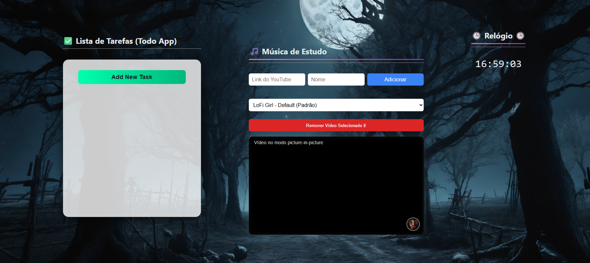

# Auxiliador de Produtividade

Este projeto é uma aplicação web que combina **gestão de tempo, foco e tarefas** em um só lugar, com um design limpo e minimalista.  
Contém um relógio digital, um mini player do YouTube para músicas de estudo e um aplicativo de tarefas (Todo App), tudo em uma interface moderna.

## Motivação

Sempre tive dificuldade com métodos tradicionais como o Pomodoro, pois acabava focando mais no tempo do que na própria tarefa. Tive a ideia de usar as cores do relógio para representar blocos do dia, com base no horário atual, e mostrar apenas a tarefa do momento.  

Mas eu vi que ainda havia muito espaço para melhorias, inclusive, fazer o projeto funcional para outras pessoas.  
Decidi melhorar uma Todo List e integrar isso ao meu projeto de produtividade.

Na versão inicial do projeto, o vídeo era fixo, definido no código fonte, o que não é uma boa ideia para o usuário. Mas tive a ideia de armazenar as opções com localStorage, de modo que o usuário pode enviar os links e selecionar o vídeo a ser tocado.

## Objetivo

Criar um ambiente de produtividade pessoal com:
- Relógio dinâmico com atividades programadas por blocos de tempo
- Todo List para registrar e organizar tarefas
- Mini player de YouTube com seleção personalizada de músicas
- Layout modular, acessível e expansível

---

## O problema que esse projeto busca resolver

Hoje, muitas pessoas enfrentam dificuldades para manter o foco ao estudar, trabalhar ou aprender algo novo. Existem várias ferramentas separadas para relógio, listas de tarefas e música ambiente, mas nunca vi uma que une tudo isso em **um único espaço visual coerente e funcional**.

Com esse projeto, busco resolver isso ao oferecer tudo que for conveniente para essa organização em conjunto.

---

## Funcionalidades

- **Relógio Digital:** Exibe o horário atual em destaque.
- **Mini Player do YouTube:** Player embutido para músicas de estudo, já configurado para autoplay e mudo.
- **Todo App:** Permite adicionar, editar e remover tarefas, com campos para título, data e descrição.

## Tecnologias Utilizadas

- [HTML5](https://developer.mozilla.org/pt-BR/docs/Web/HTML)
- [CSS3](https://developer.mozilla.org/pt-BR/docs/Web/CSS)
- [JavaScript](https://developer.mozilla.org/pt-BR/docs/Web/JavaScript)

## Estrutura de Pastas

```
projeto/
│
├── css/
│   └── styles.css
│   └── list-styles.css
├── scripts/
│   ├── clock.js
│   └── list.js
│   └── video.js
├── index.html
```


## Customização

- Para alterar o vídeo do player, modifique o atributo `src` do `<iframe>` no HTML.
- Para personalizar estilos, edite o arquivo `css/styles.css` ou adicione classes do Tailwind diretamente no HTML.

## Screenshots



---

## Observações
- A imagem de fundo é da lexica.art.